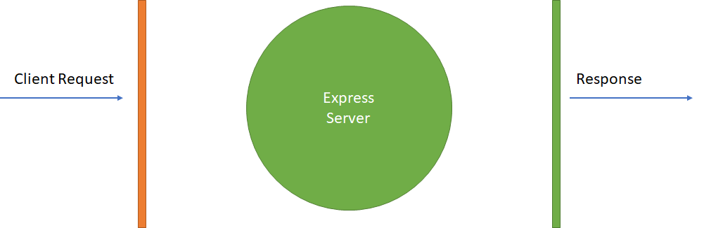
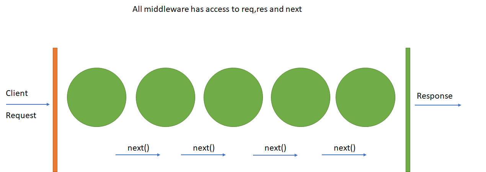
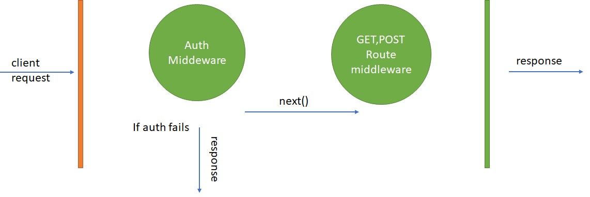

**Middleware functions** are functions that have access to the **request object** `(req)`, the **response object** `(res)`, and the `next` **middleware function** in the application’s **request-response cycle**.
The next middleware function is commonly denoted by a variable named next.

- As name suggests it comes in middle of something and that is request and response cycle
  🛑 Middleware has access to **request and response object** 🛑
  🛑 Middleware has access to **next** function of **request-response life cycle**



#### Middleware functions can perform the following tasks:

👉 Execute any code.

👉 **Make changes to the request and the response objects.**

👉 End the **request-response cycle.**

👉 **Call the next middleware in the stack.**

🛑 👉 If the **current middleware function does not end the request-response cycle, it must call `next()`to pass control to the next middleware function. Otherwise, the request will be left hanging.**

### What is this **`next()`**?

👉 A **middleware** is basically a **function that will do the receive the Request and Response objects,** just like your **route Handlers do**.

- As a third argument you have another function which you should call once your middleware code completed.
- This means you **can wait for asynchronous database or network operations to finish** before proceeding to the next step. This might look like the following:



🛑 If the **current middleware function does not end the request-response cycle,** it must call **`next()`** to pass control to the next middleware function. Otherwise, the request will be left hanging

### Types of express middleware

- Application level middleware **`app.use`**

- Router level **middleware `router.use`**
- Built-in middleware express.static,**`express.json,express.urlencoded`**
- Error handling middleware **`app.use(err,req,res,next)`**
- Thirdparty middleware **`bodyparser,cookieparser`**

### Application Level Middleware

#### Example 1 : Auth middleware

Suppose we are having five routes getUsers,getDetails,updateDetails,isLoggedIn,isLoggedOut
every route must be authenticated if the user is not authenticated then he is not able to call the above mentioned routes,so every GET,POST calls required authentication.In this case we build a authtication middleware.
Now once the request comes the auth middleware will do some authentication logic that we have written inside it.Once authentication successful then remaining routed must be called using next()

- **In case if auth fails then it wont perform next route exit the middleware with error response logic**



Example: Logging Middleware

```js
const express = require("express");

// custom middleware create
const LoggerMiddleware = (req, res, next) => {
  console.log(`Logged  ${req.url}  ${req.method} -- ${new Date()}`);
  next();
};

const app = express();

// application level middleware
app.use(LoggerMiddleware);

// users route
app.get("/users", (req, res) => {
  res.json({
    status: true,
  });
});

// save route
app.post("/save", (req, res) => {
  res.json({
    status: true,
  });
});

app.listen(3002, (req, res) => {
  console.log("server running on port 3002");
});
```

### Router Level Middleware

**Router-level middleware works in the same way as application-level middleware, except it is bound to an instance of `express.Router()`.**

```js
const router = express.Router();
```

**Load router-level middleware by using the `router.use()`and `router.METHOD()` functions.**

```js
const express = require("express");

const app = express();

const router = express.Router();

router.use((req, res, next) => {
  console.log("Time:", new Date());
  next();
});

router.get(
  "/user/:id",
  (req, res, next) => {
    console.log("Request URL:", req.originalUrl);
    next();
  },
  (req, res, next) => {
    console.log("Request Type:", req.method);
    next();
  },
  (req, res) => {
    res.json({
      status: true,
      id: req.params.id,
    });
  }
);

app.use("/", router);

app.listen(3000, (req, res) => {
  console.log("server running on 3000");
});
```

#### Error Handing Middleware

Express JS comes with default error handling params, define error-handling middleware functions in the same way as other middleware functions, except error-handling functions have four arguments instead of three:

```js
app.use(function (err, req, res, next) {
  console.error(err.stack);
  res.status(500).send("Something broke!");
});
```

### Third-party Middlewares

In some cases we will be adding some extra features to our backend
Install the Node.js module for the required functionality, then load it in your app at the application level or at the router level.

Example: body-parser

👉 All middlewares will populate the `req.body` property with the parsed body when the Content-Type request header.

**`app.use({urlencoded:false})`**

```js
const express = require('express');
const bodyParser = require('body-parser');
const app = express();

app.use(bodyParser.urlencoded({extended:false}))

app.use(bodyParser.json())

app.post('/save',(req,res)=>{
  res.json({
    "status":true,
    "payload":req.body
  })
}

app.listen(3000,(req,res)=>{
    console.log('server running on port')
})
```

#### Check the partial list of third-party middleware functions that are commonly used with Express

[List of third-party middleware](https://expressjs.com/en/resources/middleware.html)
